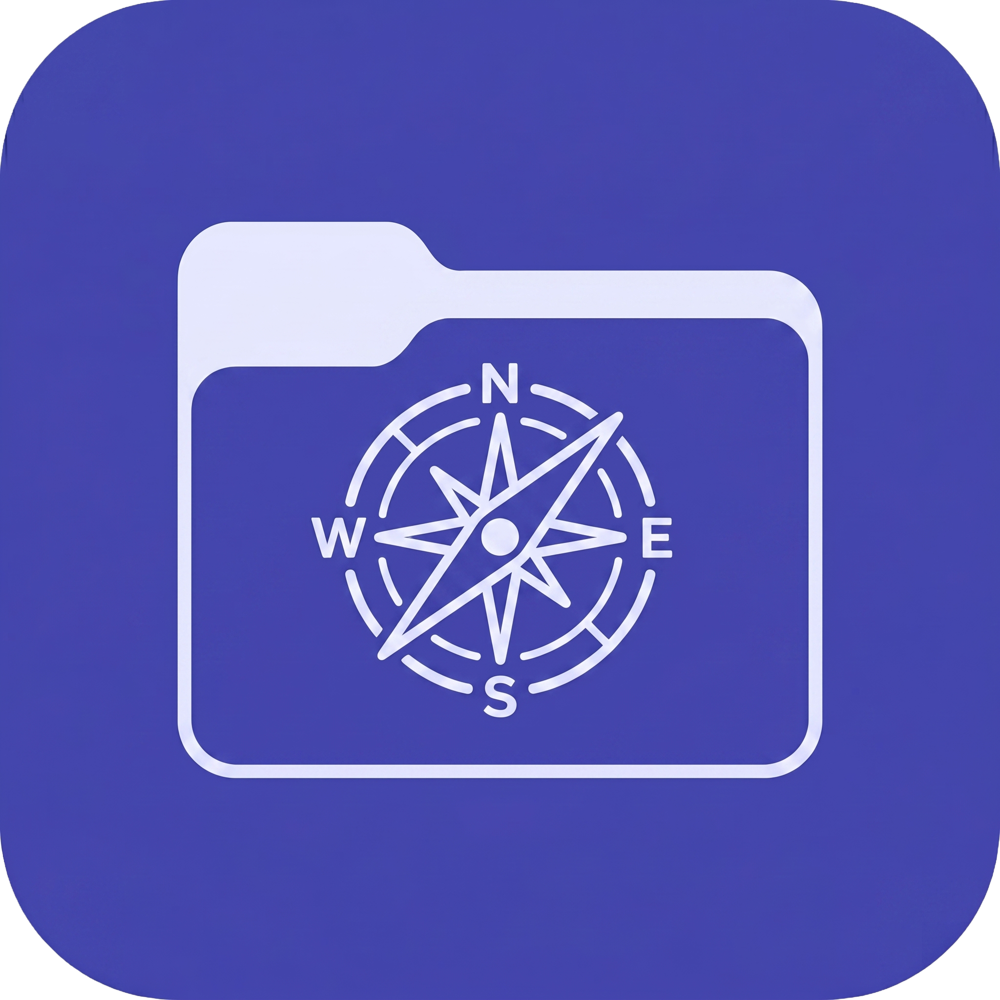

<div align="center">
  
  
  # NexExplorer

  **The ultimate modern File Explorer for Windows.** <br/>
  Built with Tauri, React, and Rust for blazing-fast performance.

  [](https://reactjs.org/)
  [](https://tauri.app/)
  [](https://www.typescriptlang.org/)
  [](https://tailwindcss.com/)
  [](https://www.rust-lang.org/)
</div>

<br/>

**NexExplorer** is a fully-featured, high-performance file manager designed to replace the standard Windows File Explorer. It combines a beautiful modern user interface with powerful built-in network sharing (LocalShare) and a suite of advanced power-user utilities.

## ✨ Key Features

- 🚀 **Modern UI & Layout**: A beautiful, responsive interface featuring multi-tab navigation, breadcrumbs, and a sleek dark/light mode aesthetic built with Tailwind CSS v4.
- ⚡ **Blazing Fast**: Powered by a Rust backend (Tauri) for heavy lifting and a lightweight React frontend, making file operations and navigation instantaneous.
- 🔄 **LocalShare Integration**: Seamless, cross-device local file sharing. Fully compatible with the LocalSend mobile and desktop protocol over UDP/HTTP.
- 🛠️ **NexTools Utility Suite**:
  - **Disk Space Analyzer**: Visual drill-down of directory sizes.
  - **Duplicate File Finder**: Uses robust SHA-256 hashing to safely find and remove duplicate files.
  - **Hash Checker**: Instantly verify MD5 and SHA-256 integrity.
- 👁️ **Quick Look**: Press `Spacebar` for an ultra-fast preview overlay for images, videos, audio, and syntax-highlighted text.
- 🗂️ **Advanced File Operations**: Batched copy/move, dynamic sorting, folder size calculation, and more.

## 💻 Tech Stack

- **Frontend**: React 19, TypeScript, Tailwind CSS v4, Framer Motion, Zustand
- **Backend / Desktop**: Tauri v2, Rust
- **Build Tool**: Vite

## 🚀 Getting Started

### Prerequisites

Before you begin, ensure you have the following installed:
- [Node.js](https://nodejs.org/en/) (v18 or higher)
- [Rust](https://www.rust-lang.org/tools/install)
- [Tauri Prerequisites](https://tauri.app/v1/guides/getting-started/prerequisites) (C++ build tools on Windows)

### Installation

1. **Clone the repository:**
   ```bash
   git clone https://github.com/Shabaz2009/NexExplorer.git
   cd NexExplorer
   ```

2. **Install frontend dependencies:**
   ```bash
   npm install
   ```

3. **Start the development server:**
   ```bash
   npm run tauri dev
   ```

4. **Build for production:**
   ```bash
   npm run tauri build
   ```
   The compiled executable will be located in `src-tauri/target/release/`.

## 🤝 Contributing

Contributions, issues, and feature requests are welcome! Feel free to check the [issues page](../../issues).

1. Fork the Project
2. Create your Feature Branch (`git checkout -b feature/AmazingFeature`)
3. Commit your Changes (`git commit -m 'Add some AmazingFeature'`)
4. Push to the Branch (`git push origin feature/AmazingFeature`)
5. Open a Pull Request

## 📝 License

This project is open-source. Please see the `LICENSE` file for more details.

---
<div align="center">
  <i>Built with ❤️ by Shabaz</i>
</div>
